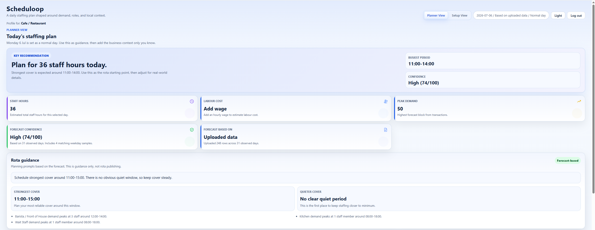
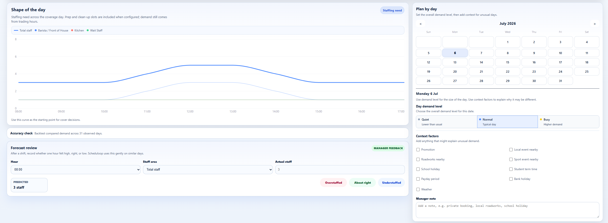
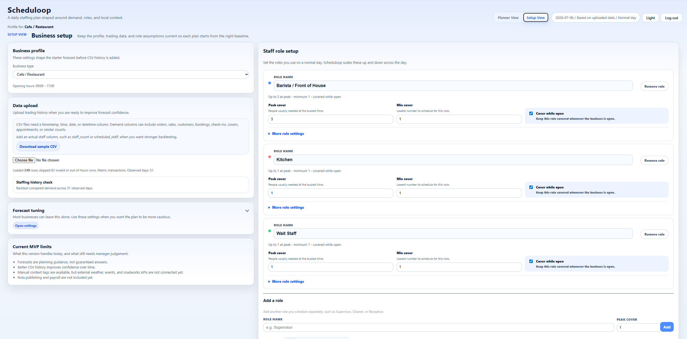

# Scheduloop

Scheduloop is a workforce forecasting app for small businesses. It helps a gym, cafe, restaurant, or similar business turn expected demand into a practical staffing plan across the day.

## Preview








## Current MVP

Scheduloop currently includes:

- Firebase sign up, login, and user-specific business profile storage.
- Guided onboarding for business type, roles, opening hours, and staffing assumptions.
- A dashboard showing expected staffing need across the day.
- Role-level staffing lines for areas such as front of house and kitchen.
- CSV upload for historical demand data.
- Basic backtesting against uploaded staff counts.
- Calendar settings for normal, quiet, busy, and event-style days.
- Labour-cost estimates based on average or role-level hourly wages.


## Why I built this

I built Scheduloop to practise building a realistic SaaS-style app rather than another simple to-do list or tutorial project. The idea was to create a tool that a small business manager could use to estimate staffing needs across the day based on demand, opening hours, roles, and uploaded CSV data.

The main focus was not perfect forecasting, but building a clear MVP with authentication, onboarding, stored business profiles, charts, CSV parsing, and manager-friendly recommendations.


## Tech Stack

- React 19
- Vite 7
- Firebase Authentication
- Cloud Firestore
- React Router
- Recharts
- ESLint
- Custom Node-based test runner in `scripts/run-tests.mjs`

## Setup

Install dependencies:

```bash
npm install
```

Create a local environment file:

```bash
cp .env.example .env.local
```

Fill `.env.local` with the Firebase web app config for the project. Do not commit real Firebase values.

Start the dev server:

```bash
npm run dev
```

If PowerShell blocks `npm` because of execution policy, run the same scripts through `npm.cmd`, for example:

```powershell
npm.cmd run dev
```

## Firebase Environment Variables

The app reads these Vite variables from `.env.local`:

```env
VITE_FIREBASE_API_KEY=
VITE_FIREBASE_AUTH_DOMAIN=
VITE_FIREBASE_PROJECT_ID=
VITE_FIREBASE_STORAGE_BUCKET=
VITE_FIREBASE_MESSAGING_SENDER_ID=
VITE_FIREBASE_APP_ID=
VITE_FIREBASE_MEASUREMENT_ID=
```

Required at runtime:

- `VITE_FIREBASE_API_KEY`
- `VITE_FIREBASE_AUTH_DOMAIN`
- `VITE_FIREBASE_PROJECT_ID`
- `VITE_FIREBASE_APP_ID`

The remaining values should still match the Firebase web app config when available. Keep production business data out of local sample files and browser localStorage.

## Available Scripts

```bash
npm run dev
```

Starts the Vite development server.

```bash
npm run build
```

Creates a production build in `dist`.

```bash
npm run lint
```

Runs ESLint across the project.

```bash
npm run test
```

Runs the lightweight Node test suite for scheduling, CSV parsing, demand confidence, and staffing helpers.

```bash
npm run preview
```

Serves the production build locally for review.

## CSV Upload Format

CSV uploads are used to replace the starter business preset with observed demand patterns.

Required:

- A time-like column named one of `time`, `timestamp`, `date`, `datetime`, `created_at`, or `created at`.
- At least one usable row inside the business opening hours.

Recommended demand columns:

- Counts such as `orders`, `transactions`, `sales_count`, `covers`, `customers`, `guests`, `bookings`, `appointments`, `check_ins`, `quantity`, or `units`.
- Money columns such as `sales`, `revenue`, or `total`.

Optional staffing history:

- A staff count column such as `staff`, `staff_count`, `team_size`, `scheduled_staff`, or `actual_staff`.

Current limits and behaviour:

- Maximum CSV size is 1 MB.
- Invalid rows and rows outside opening hours are skipped.
- If no demand column is found, each valid row counts as one demand event.
- Uploaded staff counts are used for backtesting, not as the source of the forecast.
- Example files live in `sample-data/`.

## Day Context

Day context tags let a business mark unusual calendar dates. Context is stored
on the selected date inside the business profile `dayConfigs` map and remains
optional, so older day type-only entries still work.

The Shape of Day forecast applies context as a conservative rule-based demand
multiplier before demand is converted into staff. Defaults are starting
assumptions only; future versions should learn business-specific effects by
comparing similar tagged days with similar untagged days.

## Limitations

This is still an MVP, so the forecasting model is intentionally simple. It does not connect to live weather, holiday, school term, payday, or local event APIs yet. Context tags currently adjust demand using fixed rule-based multipliers rather than learned business-specific patterns.

The app should be treated as staffing guidance, not an automatic rota system.

## Security and Data Notes

- Business profiles are stored in Firestore under the signed-in user's UID.
- Firestore rules should continue to enforce ownership checks before profile reads or writes.
- `.env.local` is ignored by Git and must not contain shared secrets in commits.
- Do not store sensitive production business data in localStorage or committed sample data.
- Sample CSV files should stay anonymised and synthetic.

